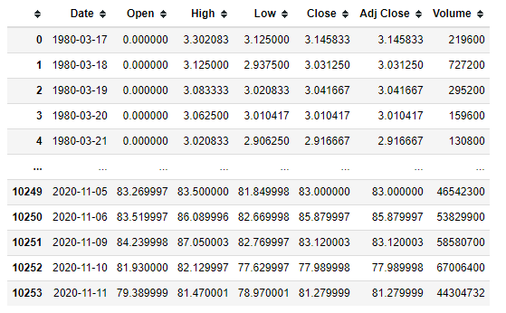
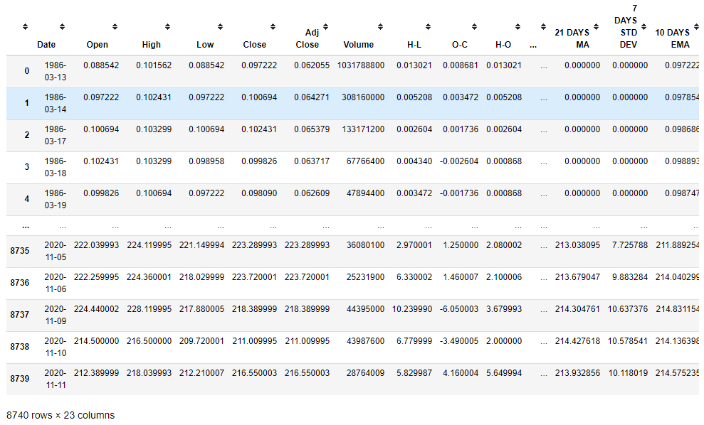
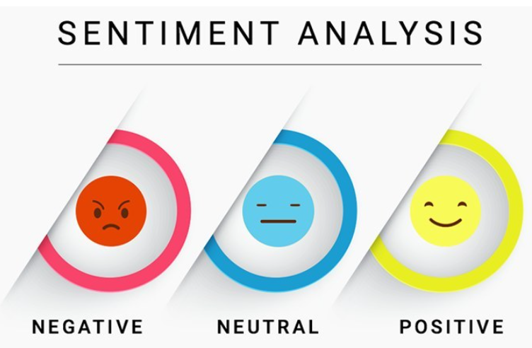
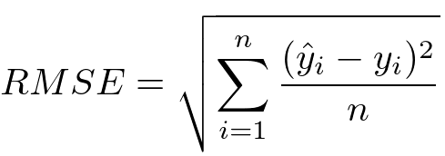
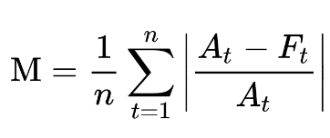

# CSCI795_final_project: Prediction of next day stock price

## Team members
- Kiseok Yang
- Patrick Du
- Chuanyao Lin

## Description
- The goal of this project is to predict the specific price of a stock at any given point based on previous existing data
- Information of price and indicators to analyze  

## Methodology
### 1. Data scrapping from finance.yahoo.com

### 2. Adding new features (indicators) into the traditional data

### 3. Data preprocessing
- Have done Min-Max normalization to make all data range from 0 to 1
- Splitting dataset into train,validation and test sets. Training data is from 2010-01-04 to 2018-01-03, validation data is from 2018-01-04 to 2020-01-02 and testing data is from 2020-01-03 to 2020-11-11
- Each instance has information of previous 10 days that would be 2 dimensional data (days-features) and training/validation/testing datasets are 3 dimensional.

### 4. Feature selection with SVM-RFE model

### 5. Analyzing newsheadlines 

### 6. Training them with LSTM model

### 7. Evaluation with error calculation (RMSE, MAPE)

 
 
 

## Technical background
- KNN/Logistic regression for Sentiment Analysis on news headlines
- SVM-RFE for Feature Selection to optimized features
- Conv1d+LSTM to make more accurate prediction on the strock

## Reference
- Taewook Kim, Ha Young Kim.(2019) “Forecasting stock prices with a feature fusion LSTM-CNN model using different representations of the same data”, PLOS ONE Journals,
- Mehtab, S., Sen, J., Dutta, A. (2020). “Stock Price Prediction Using Machine Learning and LSTM-Based Deep Learning Models”. Conference: Second Symposium on Machine Learning and Metaheuristic Algorithms and Applications (SOMMA'20) at: Vellore Institute of Technology, Chennai, INDIA.
- Nelson, D.M.Q.; Pereira, A.C.M.; de Oliveira, R.A. Stock market’s price movement prediction with LSTM neural networks. In Proceedings of the 2017 International Joint Conference on Neural Networks (IJCNN), Anchorage, AK, USA, 14–19 May 2017.
- B. Li, Q. Wang, and J. Hu, “Feature subset selection: A correlation based SVM filter approach,” IEEJ Trans. on Electrical and Electronic Engineering, vol. 6, no. 2, pp. 173–179, March 2011.
- Y. Lin, H. Guo and J. Hu, "An svm-based approach for stock market trend prediction", Neural Networks (IJCNN) The 2013 International Joint Conference on, pp. 1-7, 2013.
- Shen, S., Jiang, H., & Zhang, T. Stock Market Forecasting Using Machine Learning Algorithms. 
- Kalyanaraman, V., Kazi, S., Tondulkar, R., & Oswal, S. (2014). Sentiment Analysis on News Articles for Stocks. Sentiment Analysis on News Articles for Stocks - IEEE Conference Publication. https://ieeexplore.ieee.org/document/7079267.
